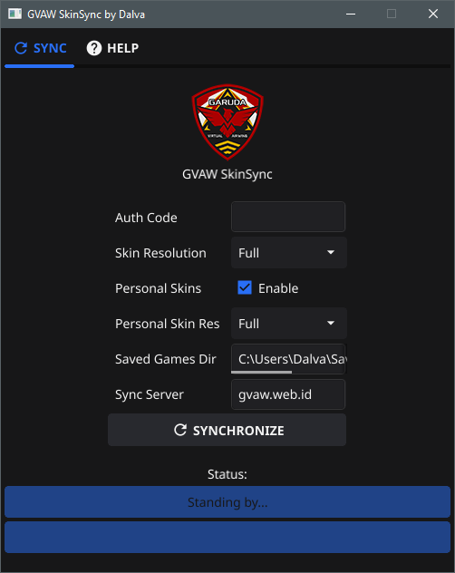

#   Garuda Virtual Air Wing Skin Sync

  

A software by Dariel Valdano

# Overview

GVAW SkinSync solves the problem of needing to synchronize everyone's skins in a Squadron.

Utilizes the [Alastor](https://github.com/dalva24/Alastor) concurrent file downloader to ensure maximum download speeds and stability even in some of the world's worst internet connections

Please report any issues in the issues page!

# Usage
1. Simply download the latest version from the [Releases Page](https://github.com/dalva24/GVAWSkinSync/releases) and extract it somewhere.
2. Run SkinSync.exe
3. Enter your Authentication code as distributed in secure channels.
4. Choose your required skin resolutions (NOTE: currently this feature is INOP, as it is under development)
5. Choose whether to enable or disable personal skins
6. "Saved Games Dir" is automagically detected, ensure it is correct.
7. "Sync Server" should be gvaw.web.id unless otherwise noted
8. Click SYNCHRONIZE and sit back, relax.
9. Once the status shows "DONE 100%", you can close the program and start DCS as usual.
